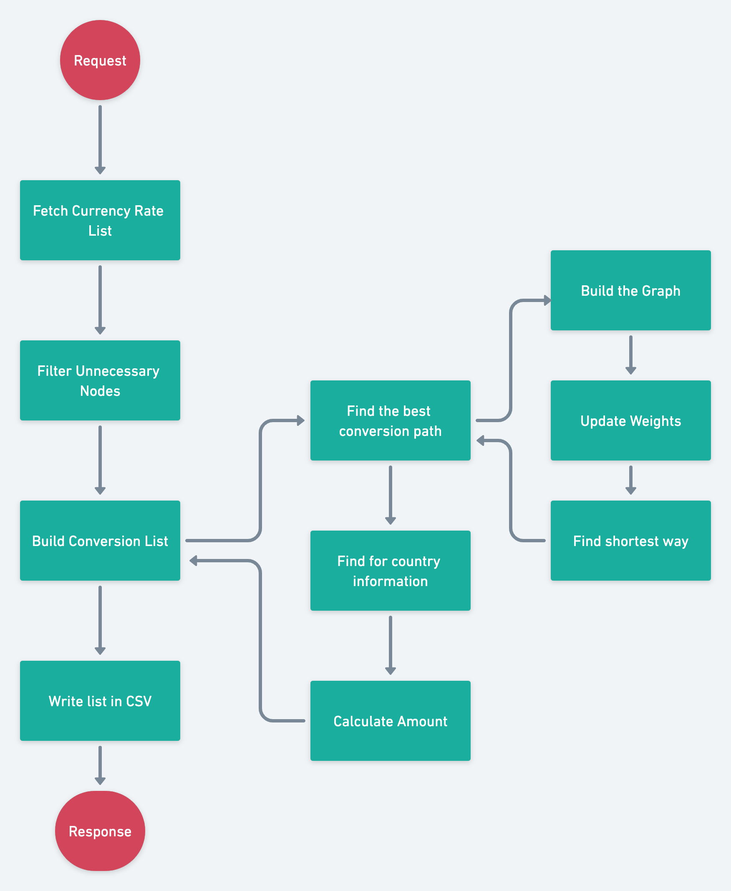
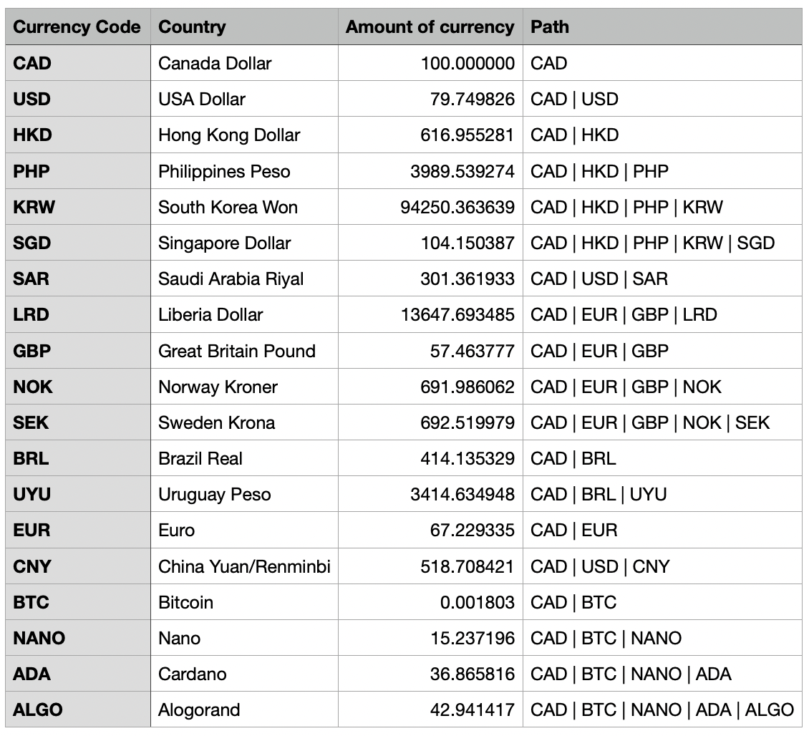

<head>
	<h1>  Currency Conversion API  </h1>
</head>
<body>
	

  

  
  ##  Description:  
   - This project is an API that looks for the best conversion of a currency given a certain availability of conversions. 
   
  ##  Running:  
   - Clone code - "git clone url_repository" .

   - Running "npm install" in path .
   
   - Create an .env file from .envexample
   
   - run "npm run start:dev"
  ## Features:
  - Finding the best conversion path
  - CSV generation with conversion data

  ## Route:
  - GET : /conversion

  ##  The Problem:
   - Imagine that a bank is having some difficulty in converting some currencies to serve its customers, but it has a partner network in which it can use other currencies to carry out this exchange:

   - Ex: A customer needs to exchange 100 Canadian Dollars to Euro, but the bank does not have Euro for the exchange, but he has an American partner that he can convert 100 Canadian Dollars to US Dollar and his partner converts to Euro, CAD -> USD -> EUR, given this possibility, the manager asked for a report containing all the conversion possibilities, but that they are the smallest and best possible for his client.

  ##  The Proposed Solution:
   - To solve this problem, we developed an api that has a conversion route, where upon request a CSV file will be generated with all the best conversions for the given group of currencies and possible conversions.

   - The great challenge of the project is the search for the best conversion of each currency, where for this we use the Djikstra algorithm as a basis, having as a point of attention that the problem is a directed graph which made us have the approach of for the In the opposite sense of the node we put an infinite weight.

  ##   Diagram:
	

  ##   Result:
	

	
  ##   RFC:

   - We explain in more detail about the implementation of the API and Dijkstra in the link: [RFC - Currency Conversion API](https://unexpected-territory-205.notion.site/RFC-Currency-Conversion-API-22acfbb51ca94c6ca45a8dac77334fa5)

</body>

<footer>
  
Mário Wessen - <a href="mailto:mariowessen@gmail.com">mariowessen@gmail.com</a>

</footer>

